# Azure DevOps Pipeline for App Service and SQL Database Deployment

This project provides a complete CI/CD setup using Azure DevOps, Bicep templates, and PowerShell automation with Azure API to deploy an App Service and SQL Database securely integrated with Azure Key Vault.

---

## 🚀 Overview

- **Infrastructure-as-Code**: Deployed using modular Bicep templates
- **Secrets Management**: Integrated with Azure Key Vault
- **CI/CD Pipeline**: Azure DevOps pipeline with validation, deployment, and testing stages

---

## 🧰 Prerequisites

- Azure DevOps organization and project
- Azure Resource Manager service connection (e.g., `ThisIsAServiceConnection`)
- PowerShell 7+ and Azure CLI (for local testing)
- Update `Create-Environment.ps1` with your values

---

## 🔧 Getting Started

1. Update variables in `.\Ancillury\Create-Environment.ps1`
2. Set up your Azure DevOps project and pipeline (**steps below**)
3. Copy all these files over to your new repo minus the *.git* folder
4. Run the environment setup script:
   ```powershell
   .\Ancillury\Create-Environment.ps1
   ```
5. Push to `main` to trigger the pipeline

---

## 🗂️ Project Structure

- `main.bicep`: Core infrastructure (App Service, SQL, VNet, etc.)
- `azure-pipelines.yml`: Azure DevOps pipeline
- `TestSql.ps1`: Kudu-executed integration test
- `Ancillury/`: PowerShell scripts to provision infra and connect to DevOps

---

## 🧱 Infrastructure Provisioning Workflow

1. Create Resource Group
2. Create Key Vault & Add Secrets
3. Assign access to DevOps
4. Create DevOps Variable Groups
5. Run `Create-Environment.ps1`

---

## ✨ Creating the Environment

### 1. Create a New Azure DevOps Project


### 2. Create a New Service Connection


### 3. Initialize the Repo


### 4. Update PowerShell Variables


### 5. Create Pipeline


### 6. View New Pipeline


### 7. Run Environment Script


### 8. Approve Variable Group Permissions


---

## 🛠️ Pipeline Breakdown

The `azure-pipelines.yml` file defines a multi-stage pipeline:

| Stage                | Purpose                                               |
|---------------------|-------------------------------------------------------|
| Validate_Variables  | Print and confirm expected inputs/variables           |
| Validate_Bicep      | Run `bicep build` and syntax validation               |
| Deploy              | Deploys full infra using `main.bicep`                |
| TestIntegration     | Deploys & runs a PowerShell test via Kudu API         |

### CI/CD Flow

```mermaid
flowchart TD
    A[Trigger Push] --> B[Validate_Variables]
    B --> C[Validate_Bicep]
    C --> D[Deploy Infra]
    D --> E[Test via Kudu]
    E --> F[Done ✅]
```


---

## 🧪 Test Script

- `TestSql.ps1` validates SQL Server accessibility from the deployed App Service using its private DNS name.
- Executed using the Kudu API post-deployment.

---

## 🔐 Security Features

- Secrets injected from Key Vault
- No secrets stored in YAML or scripts
- Private DNS + VNet injection for App → SQL

---

## 📎 References
- [Azure Pipelines Docs](https://learn.microsoft.com/en-us/azure/devops/pipelines/)
- [Mermaid Live Editor](https://mermaid.live)

---

## ✅ Final Tips

- Commit all infra to Git before pipeline trigger
- Always validate Bicep before applying
- For clean redeploys, reset variable groups or resource group manually

