# Azure DevOps Pipeline for App Service and SQL Database Deployment

This project provides a complete CI/CD setup using Azure DevOps, Bicep templates, and PowerShell automation with Azure API to deploy an App Service and SQL Database securely integrated with Azure Key Vault.

> ⚠️ **Warning:** Here be dragons. This is a dev/play environment so I can quickly test new ideas. This is not best practice by any sense of imagination. Although this workflow does not contain secrets, it does show how to retrive secrets and push them to the logs, (*yes, yes.. I know that Azure Devops does not show "Secrets" per se, but you get the idea*)

---

## 🚀 Overview

- **Infrastructure-as-Code**: Deployed using modular Bicep templates
- **Secrets Management**: Integrated with Azure Key Vault
- **CI/CD Pipeline**: Azure DevOps pipeline with validation, deployment, and testing stages

---

## 🧰 Prerequisites

- Azure DevOps organization and project
- The files and folders in this repo, minus the .git directory, in the project's git repo
- Azure Resource Manager service connection (e.g., `ThisIsAServiceConnection`)
- PowerShell 7+ and Azure CLI (for local testing)
- Update `Create-Environment.ps1` with your values

---

## 🔧 Getting Started

1. Set up your Azure DevOps project and pipeline (**steps below**)
2. Update variables in `.\Ancillury\Create-Environment.ps1` (**steps below**)
3. Copy all these files over to your new repo minus the *.git* folder
4. Run the environment setup script:
   ```powershell
   .\Ancillury\Create-Environment.ps1
   ```
5. Push to `main` to trigger the pipeline

---

## 🗂️ Project Structure

- `main.bicep`: Core infrastructure (App Service, SQL, VNet, etc.)
- `azure-pipelines.yml`: Azure DevOps pipeline
- `TestSql.ps1`: Kudu-executed integration test
- `Ancillury/`: PowerShell scripts to provision infra and connect to DevOps

---

Based on the uploaded provisioning scripts, here's a more detailed and copy-paste-ready version of the **Infrastructure Provisioning Workflow** section for your `README.md`:

---


## 🧱 Infrastructure Provisioning Workflow `Create-Environment.ps1`

The `Create-Environment.ps1` script is a one-stop provisioning workflow designed to set up the core infrastructure and DevOps integration for this pipeline. It stitches together several modular scripts to create a ready-to-go environment.

> *Note:* Make sure you've completed the prerequisites. See **Creating the Environment**

### 🧭 Provisioning Flowchart


### 🔄 Steps Performed by the Script

1. **Set Subscription Context**
   - Uses `1_Set-AzSubscriptionContext.ps1` to ensure all resources are created under the correct Azure subscription.
   - Validates and sets the context using the specified `SubscriptionId`.

2. **Create Resource Group**
   - Executes `2_New-AzResourceGroup.ps1` to create a resource group where all the infrastructure components will be deployed.

3. **Deploy Azure Key Vault**
   - Calls `3_New-AzKeyVault.ps1` to create a Key Vault with soft delete and purge protection enabled.
   - Adds a user-specified tag to help with resource classification.

4. **Assign Access to Key Vault**
   - Executes `4_Add-UserRoleToKeyVault.ps1` to assign Key Vault access policies to the current user.
   - This allows subsequent scripts to add and retrieve secrets securely.

5. **Add Secrets to Key Vault**
   - Runs `5_Add-AzPasswordToKeyvault.ps1` to generate and store secrets like SQL admin credentials.

6. **Set Azure DevOps Access to Key Vault**
   - Uses `6_set-KeyVaultDevOpsserviceConnectionRights.ps1` to assign access to the Azure DevOps service principal.
   - This allows pipelines to read secrets at runtime.

7. **Create DevOps Variable Group**
   - `7_new-AzDevOpsLibraryGroup.ps1` creates a standard Azure DevOps Library Variable Group.
   - Useful for non-secret configuration shared across pipeline stages.

8. **Create DevOps Variable Group (from Key Vault)**
   - Runs `8_new-AzDevOpsLibraryGroupFromKeyVault.ps1` to create a second variable group linked to the Key Vault.
   - Secrets are referenced securely at runtime via Azure DevOps integration.

### 🧪 Result

By the end of this script, you’ll have:

- A new resource group
- A secure Key Vault with secrets and appropriate access policies
- Azure DevOps pipeline access configured for secret injection
- Two fully populated Azure DevOps variable groups (standard + secret-linked)

One complete you can now push your code to `main` and watch the pipeline kick off automagically.

---

## ✨ Creating the Environment

### 1. Create a New Azure DevOps Project


### 2. Create a New Service Connection


### 3. Initialize the Repo


### 4. Update PowerShell Variables


### 5. Create Pipeline


### 6. View New Pipeline


### 7. Run Environment Script


### 8. Approve Variable Group Permissions


---

## 🛠️ Pipeline Breakdown

The `azure-pipelines.yml` file defines a multi-stage pipeline:

| Stage                | Purpose                                               |
|---------------------|-------------------------------------------------------|
| Validate_Variables  | Print and confirm expected inputs/variables           |
| Validate_Bicep      | Run `bicep build` and syntax validation               |
| Deploy              | Deploys full infra using `main.bicep`                |
| TestIntegration     | Deploys & runs a PowerShell test via Kudu API         |

### CI/CD Flow

```mermaid
flowchart TD
    A[Trigger Push] --> B[Validate_Variables]
    B --> C[Validate_Bicep]
    C --> D[Deploy Infra]
    D --> E[Test via Kudu]
    E --> F[Done ✅]
```


---

## 🧪 Test Script

- `TestSql.ps1` validates SQL Server accessibility from the deployed App Service using its private DNS name.
- Executed using the Kudu API post-deployment.

---

## 🔐 Security Features

- Secrets injected from Key Vault
- No secrets stored in YAML or scripts
- Private DNS + VNet injection for App → SQL

---

## 📎 References
- [Azure Pipelines Docs](https://learn.microsoft.com/en-us/azure/devops/pipelines/)
- [Mermaid Live Editor](https://mermaid.live)

---

## ✅ Final Tips

- Commit all infra to Git before pipeline trigger
- Always validate Bicep before applying
- For clean redeploys, reset variable groups or resource group manually

